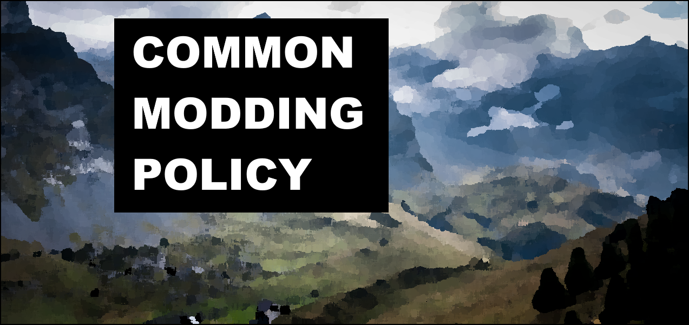

#### Contents

- [1.0 Summary](#10-summary)
- [2.0 Objectives](#20-objectives)
  - [2.1 Premise](#21-premise)
  - [2.2 Issues](#22-issues)
- [3.0 Solutions](#30-solutions)
- [4.0 Conclusions and Policy](#40-conclusions-and-policy)

### 1.0 Summary

This document outlines some issues that persist within the development scene of modded Minecraft. Moreover, this document provides some policies aimed at resolving these issues that developers may follow.

Finally, it should be noted that the ideas detailed in this document are a summary of discussions held within private modding groups and is presented on an opt-in basis.

### 2.0 Objectives

This document aims to provide a set of guidelines for developers to follow to resolve long-standing issues within the Minecraft modding scene.

#### 2.1 Premise

The following are identified as contextual prerequisites to the ideas presented in this document:

- For the purposes of this document, the term `modding` is defined as the development, updating and/or maintenance of Minecraft mods by developers - the compiling of mods to form a modpack or the use of mods by players is not considered as `modding`.
- For the purposes of this document, the terms `mod user` and `mod users` collectively refers to players who choose to use mods, as well as modpack creators.
- Minecraft mod developers often have little time to allocate to mod development, as they may work or are in education full-time.
- It is acknowledged that modding is a time-intensive activity, and that most developers do this as a hobby and make their work available to users for free.
- While this document may be applicable to multiple Minecraft products (e.g., Java, Bedrock, PE), only the modding scene for Minecraft Java Edition is considered, and henceforth the term `Minecraft` refers to Minecraft Java Edition.

#### 2.2 Issues

The issues within the Minecraft modding scene that are presented below are focussed on developers. Issues that exist but largely affect only mod users have been excluded; however, while it is true that the following issues are developer-centric, they may also affect mod users to a varying degree. 

The following two points are noted in this document as primary factors in the issues that exist within the Minecraft modding scene:

1. Minecraft has a rapid development cycle: approximately every six months a new update is released.
2. Mod users expect too much from developers.

These points are stated in isolation because they are common to most of the specific issues detailed in this document, which aims to provide solutions to the following:

1. The rapid pace of Minecraft updates, combined with the verbose community of mod users, creates an 'updating pressure' on developers to update their mods to the latest version of Minecraft. This stunts new mod development and causes stagnation in the modding scene because developers allocate more time to update their current mods, rather than developing new features or mods. This is somewhat evidenced by the decline in the amount of content per mod compared to older versions of Minecraft – i.e., mods released after Minecraft 1.16.5 tend to put greater emphasis on quality.

2. Time spent diagnosing and fixing inter-mod compatibility issues takes a lot of time away from developing features. Mod users have come to expect complete compatibility between mods, with the list of mods being used in conjunction often numbering in the hundreds. Furthermore, mod users commonly expect mods to have the same level of compatibility between each other - for example, mods that do approximately the same thing may be expected to work together as well as mods that touch on completely different parts of the game. This is an issue because developers may sacrifice performance and optimisation for compatibility reasons, even where compatibility should not necessarily be an expectation i.e., where two mods that implement the same features are used together.

3. Due to this updating pressure, developers are often only able to support the latest or latest few versions of their mods. Since developers have different rates of updating, the currently supported Minecraft version tends to differ greatly between mods; this leads to mod users often using outdated or no longer supported mod versions so that they can use their desired combination of mods together, which leads to the presentation of bugs increasing.

4. The time it takes to update mods varies greatly between Minecraft versions, as even in minor version updates some internal systems are sometimes completely reworked. This leads to unreliable update cycles for mods and often results in mod users causing developers distress through persistent timeline comments.

5. Mod users expect developers to support both Forge/Neoforge and Fabric, as well as most Minecraft versions post-1.18.2. This is unrealistic for many developers, and results in unhelpful comment spam.

6. Developers sometimes appreciate constructive feedback/suggestions and to be made aware of gameplay bugs; therefore, developers often leave communication channels open e.g., comment sections. However, constructive feedback/bug reports are often drowned out by excessive comments regarding version and modloader porting, resulting in these communication channels being suspended and ultimately a longer-term disconnect between developer and mod user.

7. Mojang maintains some relatively old-fashioned development philosophies: namely, that worlds must be cross-version compatible. Many mod users have come to expect this when updating their modded worlds, too - or even when updating between mod versions. This expectation causes issues for developers - as many developers strive for performance and/or features before cross-version compatibility.

### 3.0 Solutions

This section discusses potential solutions to the issues previously specified, and outlines relevant steps to actioning these solutions:

- One potential solution to issues 1., 3. and 4. is for developers to maintain a long-term support (LTS) version of their mod. Indeed, many developers already take this approach for previously major modding versions Minecraft 1.12.2 and 1.16.5. By maintaining a LTS version and sticking with it, new feature development can become the priority, as well as polishing/bug-fixing; additionally, the update cycle for the mod can become more regular. The disadvantage of this is that if the developer also wishes to maintain versions of their mod that update as Minecraft does, the workload may increase. Furthermore, the Minecraft version that developers choose for their LTS may be different; or it may shift if significant features are released by Mojang.

- A partial solution for issue 1. and a sensible solution for issue 7. could be for developers to not include cross-version compatibility as a prerequisite to updating their mod. What this looks like in practice is that modded Minecraft worlds would be tied to a single major version of Minecraft, and developers would not make it a priority for compatibility to be guaranteed between mod updates. This may promote performance and feature development. The disadvantage is that mod users may have to restart worlds if/when they wish to update their mods and/or Minecraft version.

- Regarding issues 2., 5. and 6., mod users' expectations must be managed better through explicit statements and messaging. Many mods already do this to some degree: descriptions will often include _"This mod is for Fabric and will not be ported to Forge"_ at the header of the page in an effort to decrease the number of comments requesting _"forge pls"_ or similar - of course, this relies on mod users reading the statement. Feedback is a valuable tool to many developers, and the importance of keeping it open, relevant, and constructive cannot be understated. To this end, it may perhaps prove useful for developers to follow a more specific policy - one that can be referred to when unhelpful comments are made. This would act to separate unhelpful spam and criticism from the mod to the modding policy and reduce the burden on the developer to explain their decisions to mod users. Finally, this would let mod users know what to expect from a mod’s development before usage.

- One potential solution for issue 2. is to acknowledge that not all mods need to be compatible with each other. Mods that do the same thing do not need to be compatible with each other. Furthermore, it should not be a requirement that mods that are specifically designed to work with certain mods (such as mod addons) be compatible with similar but unrelated mods. If mod a) has mod addon b), then mod b) should not be expected to guarantee compatibility with random mod c) - even if, for example, mods a) and c) are similar magic mods. That is not to state, however, that inter-mod compatibility should be deliberately reduced; rather, it should simply be made less of a priority/expectation than performance. 

- Finally, some mods are often part of a cohesive mod ecosystem and are designed to be used together but are made into separate mods as a form of configuration. Typical mod ecosystem architecture might include a base library or API and several content mods that rely on and work together to provide a more seamless modded experience. This enables the developer to better compartmentalise mod development and allows mod users the choice to pick what content to play with. However, in such a scenario the content mods should not be expected to work as cohesively with other mods external to this mod ecosystem i.e., mods that do not rely on the initial library/API.

### 4.0 Conclusions and Policy

This section presents some modding policies and guidance that developers may follow and refer to such that the issues detailed in this document may be resolved and/or reduced.

1. Developers should maintain a LTS version of their mod. 
	- Developers should only be expected to support one version of Minecraft long term, any other version that has releases is up to the developer and dependent on their own capability/drive.
    - Supporting one version of Minecraft should be prioritised before releasing updates to a new version.
	- If the developer has released an update for a different version of Minecraft, the version of Minecraft that was previously supported by the developer should continue to be supported.
	- However, the LTS version may change eventually when enough new features have accumulated, as subject to the developer.

2. Developers should prioritise performance over compatibility.
    
	- Where performance improvements and/or optimisations may be made that break save _persistence*_, they should be.
    - Inter-mod compatibility should not be a priority where the offending mods are functionally similar.
	- Where a mod ecosystem exists that has mods rely on a base library/API, the developer should have no obligation to ensure compatibility with mods external to that mod ecosystem.
	- However, developers should still strive to create their mods to be as compatible as possible with other mods, provided performance and development time are not significantly impacted.

3. Modded Minecraft worlds should not be version independent and once created with a certain set of mods, should only have playability ensured/supported using that version of Minecraft with those mods.

4. Mod users' expectations should be managed.

    - Developers should have a clear modding policy in place.
	- The modding policy should exist such that it may be referred to by the developer in response to unhelpful communications.
	- The modding policy should be explicit in what mod users may expect from the developer and development of the mod.

_*Worlds using prior versions of the mod are no longer compatible with newer versions of the mod._
